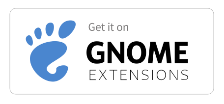

<h1 align="center">PanelNote Extended</h1>

  <strong>Add a customizable note to your GNOME panel.</strong>

  
  

  

## Overview

**PanelNote Extended** is a lightweight GNOME top-bar notes extension for quick reminders and scheduled messages.

> A maintained fork of [PanelNote](https://github.com/GittyMac/PanelNote) by [@GittyMac](https://github.com/GittyMac), adding time-based notes and panel positioning features.

## Features

- **Quick Edit** — Left-click the panel note to edit it in a popup. If a scheduled note is active, you edit that one directly.
- **Scheduled Notes** — Configure time-based notes in settings that appear automatically during set time ranges (e.g. "Lunch break" from 12:00 to 13:00).
- **Default Note** — A fallback note shown when no scheduled note is active.
- **Custom Positioning** — Place the note in the Left, Center, or Right section of the panel with a specific order index.
- **Extension Settings** — Right-click the panel note to open settings directly.
- **Native Look** — Blends seamlessly with GNOME Shell.

## Installation

## Usage

| Action | Result |
|--------|--------|
| Left-click | Opens popup to edit the active note |
| Right-click | Opens extension settings |

## Compatibility

GNOME Shell 45, 46, 47, 48, 49, 50
